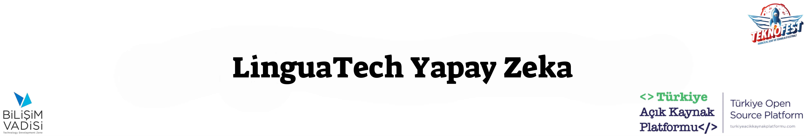
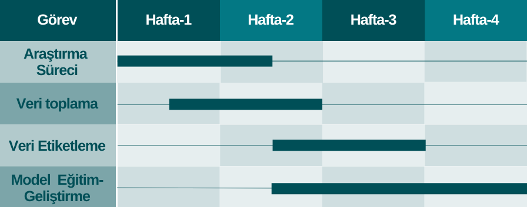
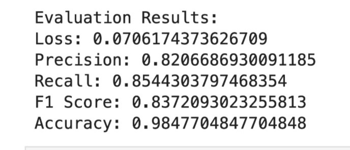
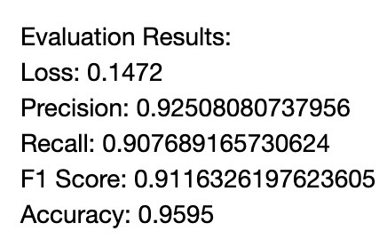

<h3 style="text-align: center;">TEKNOFEST 2024 TÜRKÇE DOĞAL DİL İŞLEME SENARYOSU KATEGORİSİ</h3>

## Proje İş Akışı


## Kullanılan Veri Setleri
* [Huggingface Turkish Dataset by Winvoker](https://huggingface.co/datasets/winvoker/turkish-sentiment-analysis-dataset)
* [Huggingface NER Dataset by Turkish NLP Suite](https://huggingface.co/datasets/turkish-nlp-suite/turkish-wikiNER)
* [Kendi Veri Setimiz](VeriSeti/sikayetler.csv)

## Model Kullanım Yönergesi
**Gerekli Python sürümü: 3.10.11**
**Modelin kullanılması için gerekli kütüphaneler requirements.txt dosyasının içinde bulunmaktadır.**

İlk önce sanal ortamı kuruyoruz.
Sanal ortamı kurmak için gerekli modül yüklenmemişse önce gerekli modülü yüklüyoruz.(Windows/MacOS)
```bash
pip install virtualenv
 ```

##### Sanal ortamımızı kuruyoruz:
Windows için:
```bash
virtualenv venv
```
MacOS için:
```bash
py -m venv .venv
```

##### Sanal ortamımızın içine giriyoruz:
Windows için:
```bash
venv\scripts\activate
 ```
MacOS için:
```bash 
source .venv/bin/activate
```


##### Gerekli kütüphanelerimizi toplu bir şekilde yüklemek için:
```bash 
pip install -r requirements.txt
```

##### Sonrasında .whl uzantılı modülümüzü yüklüyoruz:
(Dosya yolu modelin proje dosyasında olan konumudur. Örnek -> C:\Users\isminiz\Masaüstü\dosyaadı\model\tr_core_news_trf-1.0.0-py3-none-any.whl)
```bash
pip install [dosyanınyolu]/tr_core_news_trf-1.0.0-py3-none-any.whl
```

##### Komut satırından python dosyamızı çalıştırıyoruz.
Windows/MacOS için:
```bash
python serviskodu.py
```

#### NER Model Skorumuz


#### Sentiment Model Skorumuz



